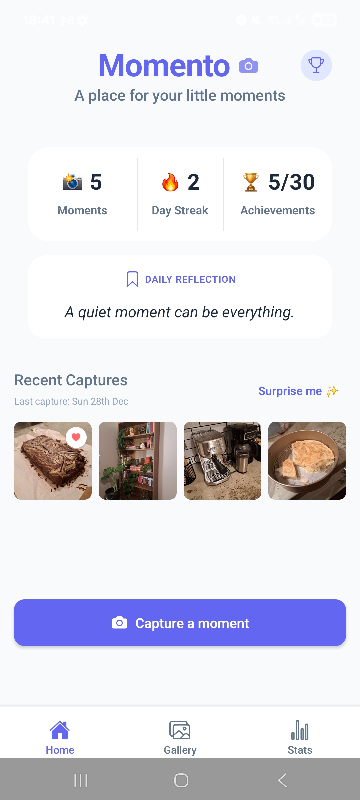
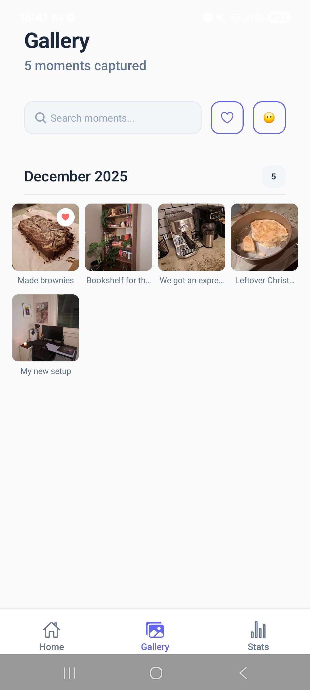
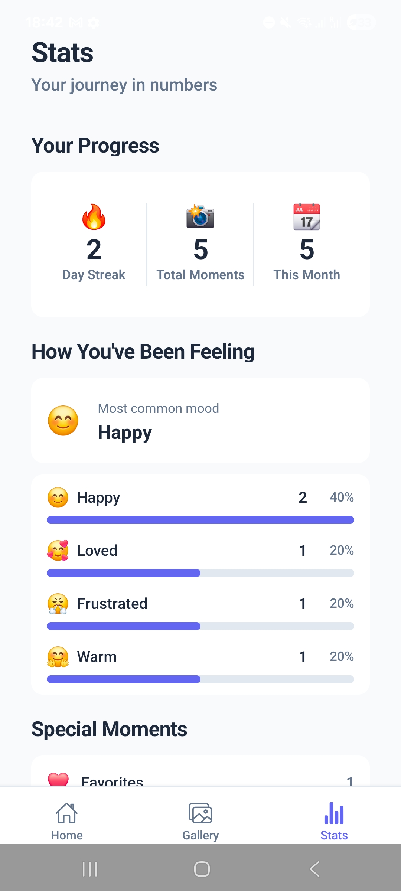
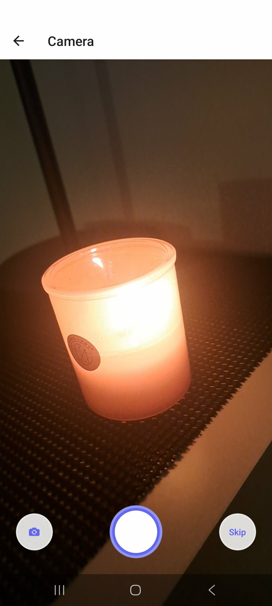
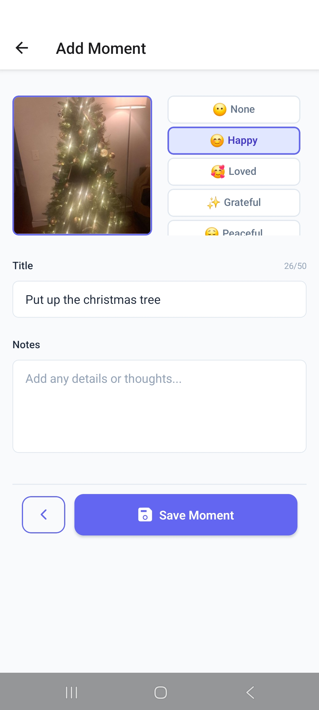
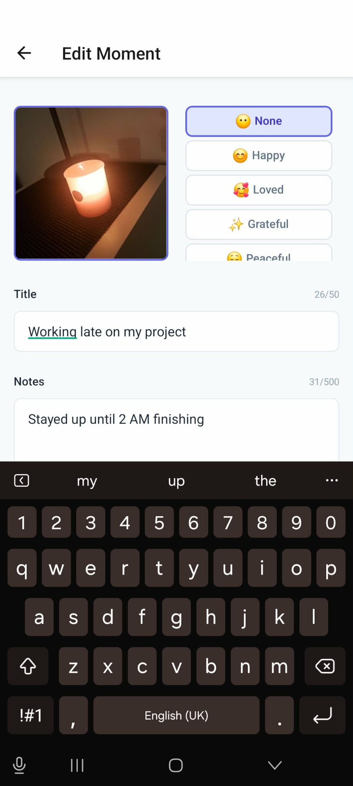

# 📸 Momento

Momento is a mobile app for capturing and reflecting on meaningful moments - big or small - using photos, mood tracking, and short notes. It is designed to encourage mindfulness and appreciation without the false pressure to "go big" on moments.
Portfolio project built as a complete React Native application using Expo.


## ✨ Features

- Capture moments using the device camera
- Attach moods and reflective notes
- Browse moments in a scrollable gallery
- Clean and intuitive UI design
- Daily streaks to build mindful habits
- Statistics for further reflection
- Achievements that encourage consistency 

## 📱 Screens

- Home
- Gallery
- Camera
- Add Moment Details
- View / Edit Moment
- Statistics
- Achievements

## 📱 App Screenshots

### **Home and Tab Pages**
| Home | Gallery | Statistics |
|------|---------|------------|
|  |  | |

### **Moments**
| Camera | Add Moment | Edit Moment | View Moment |
|--------|------------|------------|-------------|
|  |  |  |  |

### **Additional**
| Achievements|
|-------------|
|  |

## 🚀 Tech Stack

- **Framework**: React Native with Expo
- **Language**: TypeScript
- **Navigation**: Expo Router (file-based routing)
- **State Management**: React Context
- **Storage**: AsyncStorage (local persistence)
- **Camera**: Expo Camera
- **Styling**: Structured custom styling
- **Icons**: Expo Vector Icons & Symbols

## 🛠️ Installation & Setup

### Quick Start (Using Expo Go)

1. **Clone the repository**
```bash
git clone https://github.com/conor-clyde/momento.git
cd momento
```

2. **Install dependencies**
```bash
npm install
```

3. **Install Expo Go on your device**
- **iOS**: Download from [App Store](https://apps.apple.com/app/expo-go/id982107779)
- **Android**: Download from [Google Play](https://play.google.com/store/apps/details?id=host.exp.exponent)

4. **Start the development server**
```bash
npm start
```

5. **Run on your device**
- After the server starts, scan the QR code with Expo Go on your phone

## 📱 Usage
1.	Capture a moment using the camera
2.	Select a mood (optional)
3.	Add notes to reflect on the moment (optional)
4.	Browse moments in the gallery
5.	Track statistics and unlock achievements
6.	Build streaks through daily reflection

## 🎯 App Philosophy

Momento is built on the belief that life doesn't need to be extraordinary to be meaningful, encouraging users to notice and reflect on everyday moments that quietly shape their lives—whether joyful, neutral, or difficult—as a reminder that life is built from small moments, noticed.

## 📂 Project Structure

```text
src/
├── app/                 # App screens (Expo Router)
│   ├── (tabs)/          # Main tab navigation
│   ├── camera.tsx       # Camera screen
│   ├── add.tsx          # Add moment screen
│   └── achievements.tsx # Achievements screen
├── components/          # Reusable UI components
│   ├── ui/              # Base UI components
│   ├── forms/           # Form components
│   └── layout/          # Layout components
├── constants/           # App constants and data
├── contexts/            # React Context providers
├── types/               # TypeScript type definitions
└── utils/               # Utility functions
```

## 📚 What I Learned
- Building a multi-screen mobile app with Expo Router
- Managing shared state with React Context
- Working with device features such as the camera
- Designing a scalable React Native project structure
- Writing reusable and maintainable TypeScript components
- Balancing technical features with thoughtful UX design

## 🔮 Future Improvements
- Allow adding image from phone camera roll/gallery
- Haptic feedback, touch gestures
- Authentication and moment backup
- Friending and sharing between users on different accounts
- Improved accessibility and animations
- Improved statistics and achivements

## 📄 License

This project is licensed under the MIT License.

## 👨‍💻 Author

Conor Clyde
- LinkedIn: linkedin.com/in/conorclyde/
- Email: clydeconor@gmail.com

Built with ❤️ using React Native and Expo
