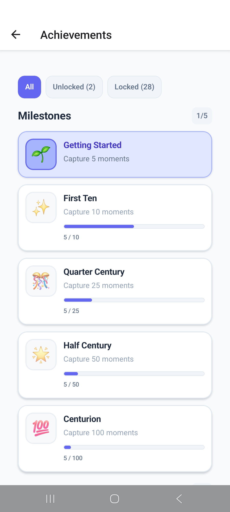

# 📸 Momento


A **mindfulness-focused mobile app** that helps users **capture and reflect on meaningful moments** through **photo journaling** and **mood tracking**. Built with **React Native and Expo**, demonstrating **full-stack mobile development** and thoughtful **UX design**.

---

## 📑 Table of Contents
- [Features](#-features)
- [App Screenshots](#-app-screenshots)
- [Tech Stack](#-tech-stack)
- [Quick Start](#quick-start-using-expo-go)
- [Project Structure](#-project-structure)
- [What I Learned](#-what-i-learned)
- [Future Improvements](#-future-improvements)
- [License](#-license)
- [Author](#-author)

---

## ✨ Features

- Capture moments using the device camera
- Attach moods and reflective notes
- Moment gallery, mood tracking, and statistics
- Clean and intuitive UI design
- Achievements and streaks to encourage mindful habits

## 📱 App Screenshots

**Home & Tabs**
| Home | Gallery | Statistics |
|------|---------|------------|
|  |  |  |

**Moment Screens**
| Camera | Add Moment | Edit Moment | View Moment |
|--------|------------|------------|-------------|
|  |  |  |  |

**Additional**
| Achievements |
|-------------|
|  |

*Screenshots shown in portrait mode, iPhone 14 Pro.*

## 🚀 Tech Stack

| Category         | Technology                |
|-----------------|---------------------------|
| Framework        | React Native with Expo    |
| Language         | TypeScript                |
| Navigation       | Expo Router (file-based)  |
| State Management | React Context             |
| Storage          | AsyncStorage              |
| Camera           | Expo Camera               |
| Styling          | Custom styles             |
| Icons            | Expo Vector Icons & Symbols |

## Quick Start (Using Expo Go)

1. **Clone the repository**
```bash
git clone https://github.com/conor-clyde/momento.git
cd momento
```

2. **Install dependencies**
```bash
npm install
```

3. **Install Expo Go on your device**
- **iOS**: Download from [App Store](https://apps.apple.com/app/expo-go/id982107779)
- **Android**: Download from [Google Play](https://play.google.com/store/apps/details?id=host.exp.exponent)

4. **Start the development server**
```bash
npm start
```

5. **Run on your device**
- After the server starts, scan the QR code with Expo Go on your phone

## 📂 Project Structure

```text
src/
├── app/                 # App screens (Expo Router)
│   ├── (tabs)/          # Main tab navigation
│   ├── camera.tsx       # Camera screen
│   ├── add.tsx          # Add moment screen
│   └── achievements.tsx # Achievements screen
├── components/          # Reusable UI components
│   ├── ui/              # Base UI components
│   ├── forms/           # Form components
│   └── layout/          # Layout components
├── constants/           # App constants and data
├── contexts/            # React Context providers
├── types/               # TypeScript type definitions
└── utils/               # Utility functions
```

## 📚 What I Learned

**Technical:**
- Built a multi-screen, cross-platform mobile app with React Native and Expo
- Managed navigation, global state, and device features like the camera
- Tackled challenges in asynchronous workflows and performance optimization

**UX & Design:**
- Designed a clean, intuitive, and responsive UI
- Created a scalable project structure with reusable TypeScript components
- Balanced technical functionality with a thoughtful user experience

---

## 🔮 Future Improvements
- Add images from phone gallery
- Haptic feedback & touch gestures
- User authentication & moment backup
- Social sharing & friending
- Enhanced accessibility & animations
- Advanced statistics and achievements

---

## 📄 License

This project is licensed under the MIT License.

## 👨‍💻 Author

**Conor Clyde**
- LinkedIn: [linkedin.com/in/conorclyde](https://linkedin.com/in/conorclyde)
- Email: clydeconor@gmail.com

Built with ❤️ using React Native and Expo
